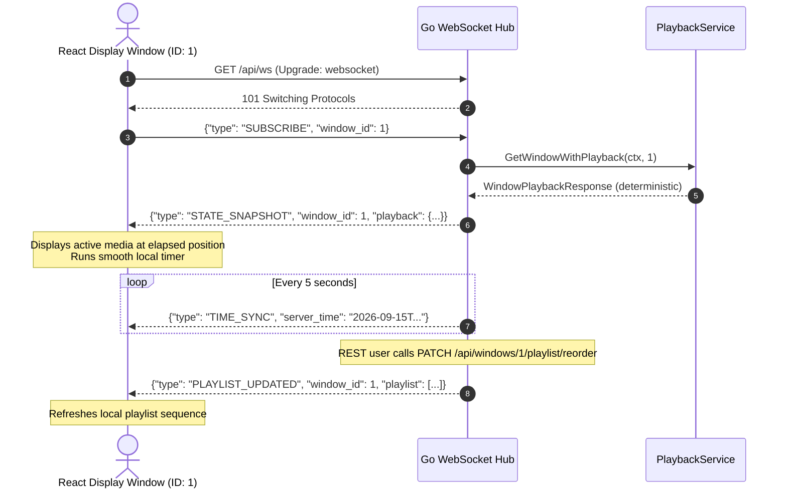

# EVA Bharat Media Sequencer — WebSocket Real-Time Protocol Specification

## 1. Overview

The EVA Bharat Media Sequencer exposes a production-grade WebSocket endpoint to maintain persistent, bidirectional, real-time communication between the Go backend and display window clients.

The WebSocket layer serves strictly as **transport and infrastructure**:
- All playback calculations are performed deterministically by the pure `PlaybackEngine` / `PlaybackService`.
- The server is **authoritative** for wall-clock time and playback status.
- Windows operate independently; clients subscribe to specific window IDs and only receive events relevant to their window (with global broadcasts reserved for system-wide sync events).

---

## 2. Connection Endpoint

### URL
- **Docker Compose**: `ws://localhost:3000/api/ws`
- **Direct Local Development**: `ws://localhost:8080/api/ws`
- **Production (TLS)**: `wss://<domain>/api/ws`

### Protocol Handshake
Clients initiate a standard HTTP `GET /api/ws` request with `Upgrade: websocket` headers. The server verifies and upgrades the HTTP connection using `gorilla/websocket`.

---

## 3. Client Lifecycle & Concurrency Model

```
Browser / Display Client
         │
         │ HTTP Upgrade to ws://localhost:8080/api/ws
         ▼
    Client Handler (ws/handler.go)
         │
    Creates Client instance with dedicated goroutines:
    ┌──────────────────────┐         ┌──────────────────────┐
    │  readPump Goroutine  │         │  writePump Goroutine │
    │  - Read JSON frames  │         │  - Write JSON frames │
    │  - Heartbeat / Pong  │         │  - Periodic Ping     │
    │  - Enforce timeouts  │         │  - Bounded send chan │
    └──────────┬───────────┘         └──────────▲───────────┘
               │                                │
               │ handleInbound()                │ SendRaw() (non-blocking)
               ▼                                │
    ┌───────────────────────────────────────────┴──────────┐
    │                 Hub (ws/hub.go)                      │
    │  - Thread-safe subscription registry (RWMutex)       │
    │  - Window-isolated client routing                    │
    │  - Periodic TIME_SYNC ticker (every 5s)              │
    │  - Safe unregistration on slow client/disconnect     │
    └──────────────────────────────────────────────────────┘
```

1. **Dedicated Read & Write Pumps**: Each connection runs two goroutines (`readPump` and `writePump`). Writes to the socket are strictly serialized through a single writer goroutine, preventing concurrent write collisions.
2. **Bounded Buffers (Slow Client Protection)**: Outgoing messages are buffered in a bounded channel (capacity: 64). If a client stalls or network degrades, messages are dropped and the slow client is disconnected cleanly rather than exhausting server memory.
3. **Panic-Proof Teardown**: Channel closure is protected by a mutex and `sync.Once`. Even under high concurrency, sends on closing channels return `false` without panicking.

---

## 4. Heartbeat & Connection Health

| Parameter | Value | Description |
|---|---|---|
| `writeWait` | `10s` | Maximum time allowed to complete a frame write to the peer. |
| `pongWait` | `60s` | Maximum time waited for a pong response from the client before terminating. |
| `pingPeriod` | `30s` | Frequency at which server sends ping frames to keep connection alive (`< pongWait`). |
| `maxMessageSize` | `64 KB` | Maximum inbound message size allowed from a client. |

When a client receives a ping frame, the WebSocket client library (or browser) automatically sends a pong frame. The server's pong handler resets the read deadline upon receipt.

---

## 5. Message Envelope & Protocol Schemas

All server-to-client messages share a unified envelope format with UTC timestamps.

### Outbound Message Envelope
```json
{
  "type": "MESSAGE_TYPE",
  "server_time": "2026-09-15T10:00:00.000000Z",
  "timestamp": "2026-09-15T10:00:00.000000Z",
  "window_id": 1,
  "playback": { ... },
  "playlist": [ ... ],
  "data": { ... },
  "code": "ERROR_CODE",
  "message": "Human readable error description"
}
```

---

## 6. Message Catalog

### 6.1. Client → Server: `SUBSCRIBE`
Immediately after establishing a WebSocket connection, a display client must identify which window it represents.

#### Request Schema:
```json
{
  "type": "SUBSCRIBE",
  "window_id": 1
}
```

#### Server Actions:
1. Validates that `window_id` is a positive integer.
2. Validates window existence via `PlaybackService.GetWindowWithPlayback`.
3. If previously subscribed to another window, safely removes old subscription and updates to new window.
4. Immediately replies with an initial `STATE_SNAPSHOT`.

---

### 6.2. Server → Client: `STATE_SNAPSHOT`
Sent immediately upon successful window subscription. Delivers complete window configuration, full ordered playlist, and deterministic playback state calculated at UTC `now`.

#### Example Payload:
```json
{
  "type": "STATE_SNAPSHOT",
  "server_time": "2026-09-15T10:00:00.123456Z",
  "timestamp": "2026-09-15T10:00:00.123456Z",
  "window_id": 1,
  "playback": {
    "id": 1,
    "name": "Window 1 - Center Display",
    "description": "Main retail center window",
    "cycle_duration_seconds": 18000,
    "epoch_start_time": "2026-09-15T05:00:00Z",
    "created_at": "2026-09-15T05:00:00Z",
    "updated_at": "2026-09-15T05:00:00Z",
    "playlist": [
      {
        "id": 101,
        "window_id": 1,
        "media_item_id": 10,
        "position": 1,
        "duration_seconds": 30,
        "is_active": true,
        "media": {
          "id": 10,
          "title": "Summer Promo Video",
          "type": "video",
          "url": "https://cdn.example.com/promo.mp4",
          "default_duration_seconds": 30
        }
      }
    ],
    "current_playback_state": {
      "started": true,
      "active": true,
      "playlist_empty": false,
      "window_id": 1,
      "playlist_item_id": 101,
      "position": 1,
      "media": {
        "id": 10,
        "title": "Summer Promo Video",
        "type": "video",
        "url": "https://cdn.example.com/promo.mp4",
        "default_duration_seconds": 30
      },
      "elapsed_seconds": 12,
      "remaining_seconds": 18,
      "cycle_position_seconds": 72,
      "total_playlist_duration": 150,
      "calculated_at": "2026-09-15T10:00:00.123456Z"
    }
  }
}
```

---

### 6.3. Server → Client: `TIME_SYNC`
Broadcast every 5 seconds to all subscribed clients. Enables clients to calculate server clock offset and maintain millisecond-accurate sync without querying REST endpoints.

#### Example Payload:
```json
{
  "type": "TIME_SYNC",
  "server_time": "2026-09-15T10:00:05.000120Z",
  "timestamp": "2026-09-15T10:00:05.000120Z",
  "data": {
    "server_time": "2026-09-15T10:00:05.000120Z"
  }
}
```

---

### 6.4. Server → Client: `PLAYLIST_UPDATED`
Broadcast automatically whenever a playlist mutation occurs (Add item, Delete item, Reorder playlist) through the REST API. Sent **only** to clients subscribed to the affected window.

#### Example Payload:
```json
{
  "type": "PLAYLIST_UPDATED",
  "server_time": "2026-09-15T10:02:15.891234Z",
  "timestamp": "2026-09-15T10:02:15.891234Z",
  "window_id": 1,
  "playlist": [
    {
      "id": 101,
      "window_id": 1,
      "media_item_id": 10,
      "position": 1,
      "duration_seconds": 30,
      "is_active": true
    },
    {
      "id": 103,
      "window_id": 1,
      "media_item_id": 12,
      "position": 2,
      "duration_seconds": 60,
      "is_active": true
    }
  ]
}
```

---

### 6.5. Server → Client: `SYNC_STARTED` & `SYNC_ENDED`
Broadcast globally to all clients when global synchronized override playback begins and concludes.

```json
{
  "type": "SYNC_STARTED",
  "server_time": "2026-09-15T10:05:00.000000Z",
  "timestamp": "2026-09-15T10:05:00.000000Z",
  "data": {
    "sync_event_id": 42,
    "media_item_id": 5,
    "duration_seconds": 30,
    "ends_at": "2026-09-15T10:05:30.000000Z"
  }
}
```

---

### 6.6. Server → Client: `ERROR`
Sent to a client when an invalid request is made or an error condition occurs.

#### Error Code Definitions:
| Error Code | Meaning |
|---|---|
| `WINDOW_NOT_FOUND` | The requested `window_id` does not exist in the database. |
| `VALIDATION_ERROR` | `window_id` is missing, zero, or negative. |
| `INVALID_JSON` | The inbound frame could not be parsed as valid JSON. |
| `UNKNOWN_MESSAGE_TYPE` | The inbound `type` string is not recognized. |
| `INTERNAL_ERROR` | Server encountered an internal error computing snapshot. |

#### Example Payload:
```json
{
  "type": "ERROR",
  "server_time": "2026-09-15T10:00:00.000000Z",
  "timestamp": "2026-09-15T10:00:00.000000Z",
  "code": "WINDOW_NOT_FOUND",
  "message": "Window not found"
}
```

---

## 7. Client Reconnection & Resilience Strategy

For production reliability (especially on physical kiosk displays and browser tabs):
1. **Exponential Backoff**: If disconnected, client attempts reconnection with exponential backoff (e.g. 1s, 2s, 4s, up to 10s maximum).
2. **Re-subscription**: On successful reconnection, client immediately sends `{"type": "SUBSCRIBE", "window_id": <id>}`.
3. **State Resynchronization**: The server responds with `STATE_SNAPSHOT`, seamlessly updating the client without requiring a full browser reload.

---

## 8. Example Interactive Session Flow


